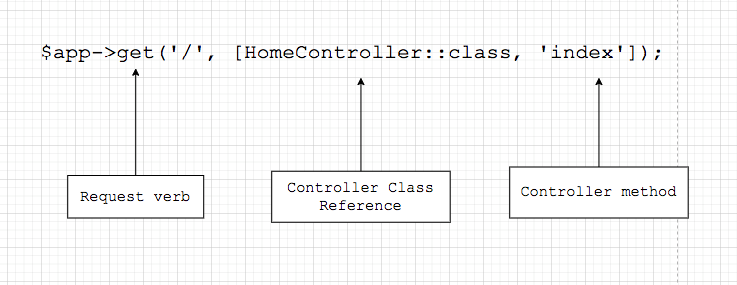

# HTTP Controllers

### Introduction
Instead of defining all of your request handling logic in a single `routes.php` file, you may wish to organize this behavior using Controller classes. Controllers can group related HTTP request handling logic into a class. Controllers are stored in the `app/Controllers` directory.

### Basic Controllers
Here is an example of a basic controller class. All MiniPHP controllers should extend the base controller class included with the default MiniPHP installation:

```php
<?php

namespace MiniPHP\Controllers;

use MiniPHP\Request;
use MiniPHP\Response;

/**
 * Home Controller
 * Class HomeController
 * @package MiniPHP\Controllers
 */
class HomeController
{

    /**
     * GET index
     * @param Request $request
     * @param Response $response
     * @return string
     */
    public function index(Request $request, Response $response)
    {
        return $response->view('welcome');
    }
}
```


### We can route to the controller action like so:
```php
<?php

use MiniPHP\Controllers\HomeController;

/**
 * -------------------------------------------------------
 *      MiniPHP Routes
 * -------------------------------------------------------
 */

$app->get('/', [HomeController::class, 'index']);
```




# Dependency Injection & Controllers
#### Constructor Injection

The MiniPHP service container is used to resolve all MiniPHP controllers. As a result, you are able to type-hint any dependencies your controller may need in its constructor. The dependencies will automatically be resolved and injected into the controller instance:

**Inject a dependency to controller constructor**
```php
$dependency = new SomeDependency();
$app->get('/', [new HomeController($dependency), 'index']);
```


```php
<?php

namespace MiniPHP\Controllers;

use MiniPHP\Request;
use MiniPHP\Response;

/**
 * Home Controller
 * Class HomeController
 * @package MiniPHP\Controllers
 */
class HomeController
{

    private \SomeDependency $myDependency;

    /**
     * HomeController constructor.
     * @param \SomeDependency $dependencyInstance
     * @return void
     */
    public function __construct(\SomeDependency $dependencyInstance)
    {
        $this->myDependency = $dependencyInstance;
    }


    /**
     * GET index
     * @param Request $request
     * @param Response $response
     * @return string
     */
    public function index(Request $request, Response $response)
    {
        return $response->view('welcome');
    }
}
```


## Method Injection
In addition to constructor injection, you may also type-hint dependencies on your controller's action methods. 

You get `Request` and `Response` object instance those are injected by AppContainer


```php
<?php

namespace MiniPHP\Controllers;

use MiniPHP\Request;
use MiniPHP\Response;

/**
 * Home Controller
 * Class HomeController
 * @package MiniPHP\Controllers
 */
class HomeController
{
    /**
     * GET index
     * @param Request $request
     * @param Response $response
     * @return string
     */
    public function index(Request $request, Response $response)
    {
        // TODO...
    }
}
```